# `/bitfab:setup` Skill Flow

Visual reference for the three phases of the Bitfab setup skill (`commands/setup.md`).
Edit the Mermaid block below to keep this in sync with the skill.

## Full flow

```mermaid
flowchart TD
    Start([User invokes /bitfab:setup mode]) --> ModeCheck{Mode}
    ModeCheck -->|all| L1
    ModeCheck -->|login| L1
    ModeCheck -->|instrument| I1
    ModeCheck -->|replay| R1

    %% ============ LOGIN PHASE ============
    subgraph LoginPhase["LOGIN PHASE"]
        direction TB
        L1["1. Run status check<br/>node status.js"] --> LAuth{Authenticated?}
        LAuth -- No --> LRun["Run login script<br/>node login.js — opens OAuth in browser"]
        LAuth -- Yes --> LKey["2. mcp: get_bitfab_api_key<br/>NEVER print full key"]
        LRun --> LKey
    end

    LKey --> LStop{login mode only?}
    LStop -- Yes --> EndLogin([Stop, report result])
    LStop -- No --> I1

    %% ============ INSTRUMENT PHASE ============
    subgraph InstrPhase["INSTRUMENT PHASE"]
        direction TB
        I1["1. Detect language<br/>identify apps vs libraries"] --> I2["2. Search for existing SDK usage<br/>per app dir in monorepos"]
        I2 --> ISDK{Existing<br/>SDK usage?}
        ISDK -- Yes --> IAskMore[/"AskUserQuestion:<br/>• Search more workflows<br/>• Continue to Replay"/]
        IAskMore -- Continue --> R1
        IAskMore -- Search more --> I345
        ISDK -- No --> I345

        I345["3-5. API key, install SDK,<br/>set BITFAB_API_KEY,<br/>mcp: setup_bitfab for SDK guide"] --> I6["6. Choose root span<br/>common ancestor of agent activity"]
        I6 --> I7["7. Read codebase<br/>find ALL AI workflows"]
        I7 --> I8["8. Present numbered list<br/>★ Pick exactly ONE workflow ★<br/>NEVER multiple, NEVER all"]
        I8 --> I9["9. Read signatures the plan references<br/>skip leaves whose shape isn't in the plan"]
        I9 --> I10Build["10a. Build trace plan under<br/>★ PURELY ADDITIVE ★ constraint"]
        I10Build --> IAdd{Requires<br/>behavior change?}
        IAdd -- Yes --> IRestructure["Restructure the TREE:<br/>siblings, separate cycles,<br/>or flatter shape"]
        IRestructure --> I10Build
        IAdd -- No --> I10Present["10b. Present trace plan<br/>AskUserQuestion to confirm"]
        I10Present --> IConfirm{User approves?}
        IConfirm -- Adjust --> I10Build
        IConfirm -- Approve --> I11["11. Instrument<br/>purely additive — no behavior change<br/>batch repetitive edits in parallel;<br/>>10-file fan-outs → subagent"]
        I11 --> I12["12. Tell user how to run app<br/>do NOT run yourself"]
        I12 --> I13["★ MANDATORY STOP ★<br/>13. mcp: search_traces (only call site)<br/>empty result is expected"]
        I13 --> INext[/"AskUserQuestion (always):<br/>A) Generate traces (only if none exist)<br/>B) Instrument next workflow<br/>C) Other workflow<br/>D) Done"/]
        INext -- A --> I8
        INext -- B --> I8
        INext -- C --> I8
        INext -- D --> IStop
    end

    IStop{instrument mode only?} -- Yes --> EndInstr([Stop])
    IStop -- No --> R1

    %% ============ REPLAY PHASE ============
    subgraph ReplayPhase["REPLAY PHASE"]
        direction TB
        R1["1. Gather all trace function keys<br/>grep getFunction / get_function / etc."] --> R2["2. Search for existing replay scripts<br/>scripts/replay.* and SDK replay imports"]
        R2 --> RCov{Coverage}
        RCov -- "Exists,<br/>missing keys" --> RAskMissing[/"AskUserQuestion:<br/>Add missing / Skip"/]
        RCov -- "Exists,<br/>all keys covered" --> EndUpToDate([Report up to date, stop])
        RCov -- "None exist" --> RAskCreate[/"AskUserQuestion:<br/>Create / Skip"/]
        RAskMissing -- Skip --> EndSkip1([Stop])
        RAskMissing -- Add --> R4
        RAskCreate -- Skip --> EndSkip2([Stop])
        RAskCreate -- Create --> R4
        R4["4. Create replay script<br/>per language, --limit, --trace-ids,<br/>per-pipeline replay fns importing actual functions<br/>(factory patterns: mock runtime context)"] --> EndDone([Done])
    end

    %% Styling
    classDef terminal fill:#dcfce7,stroke:#166534,color:#000
    classDef question fill:#fae8ff,stroke:#86198f,color:#000
    classDef constraint fill:#fee2e2,stroke:#b91c1c,color:#000

    class EndLogin,EndInstr,EndUpToDate,EndSkip1,EndSkip2,EndDone terminal
    class IAskMore,INext,RAskMissing,RAskCreate question
    class I8,I10Build,IRestructure,I11 constraint
```

## Key invariants the diagram enforces

1. **One workflow per Instrument cycle.** Step 8 takes exactly one workflow. The "next workflow" loop from step 13 always returns to step 8 — never to a parallel branch. This means one trace function, one trace plan, one set of code changes per cycle.

2. **Purely additive instrumentation.** Step 10a builds the trace plan under the constraint that the tree must be implementable without behavior changes. If a candidate tree requires `await`-ing a stream that wasn't awaited, delaying a call, reordering, blocking a callback, or restructuring control flow, the tree is invalid — restructure the *tree* (siblings, separate cycles, flatter shape), not the code.

3. **Trace plan presentation is gated.** The trace plan is never shown until the additive check passes (10a → 10b). Behavior-changing approaches are never offered as options.

4. **Skill mode gates.** `login` mode stops after the Login phase. `instrument` mode stops after the Instrument loop completes. `all` mode flows through all three phases. `replay` mode jumps straight to Replay.

5. **Replay coverage is computed before action.** The Replay phase always reads the current state first (existing keys + existing scripts), then takes one of three branches.

6. **Replay functions call real code.** Each pipeline's replay function imports and invokes the actual instrumented function — never a stub. Factory-created functions are wrapped by calling the factory with mocks for closure dependencies (stream writers, session objects).

7. **Step 13 is a mandatory AskUserQuestion stop, and the only caller of `search_traces`.** The skill never silently transitions from Instrument to Replay; an empty `search_traces` result means "offer option A," not "skip." Replay does not check for traces — scripts are created from trace function keys in code.

## Legend

| Shape | Meaning |
|---|---|
| Rectangle | Action / step |
| Diamond | Internal decision (Claude decides based on state) |
| Parallelogram | AskUserQuestion (user decides) |
| Stadium (rounded) | Terminal — flow stops |
| Red fill | Hard constraint — violating this is a bug |
| Purple fill | User interaction point |
| Green fill | Successful exit |

## How to update

When `commands/setup.md` changes (steps added, removed, reordered, or branching changes), update the Mermaid block above and re-render to verify. The diagram and the skill must agree — they document the same flow.

Same edits should be mirrored to `bitfab-cursor-plugin/skills/bitfab-setup/SKILL.md` per the CLAUDE.md plugin sync rule.
